# Before optimization

/all-students
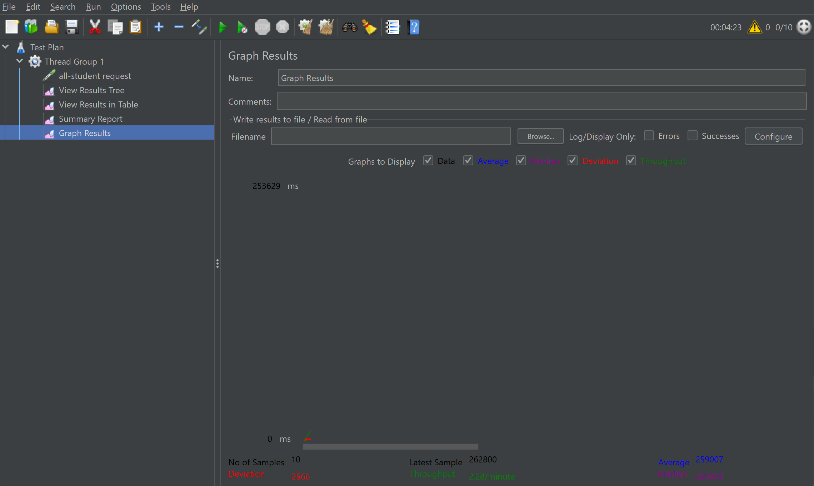
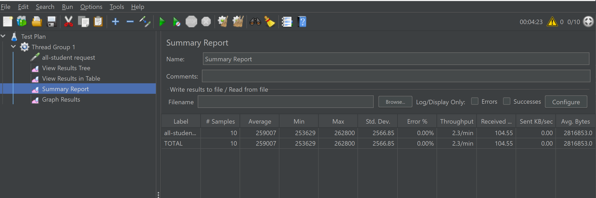
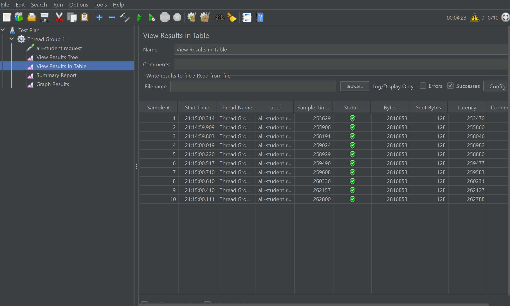
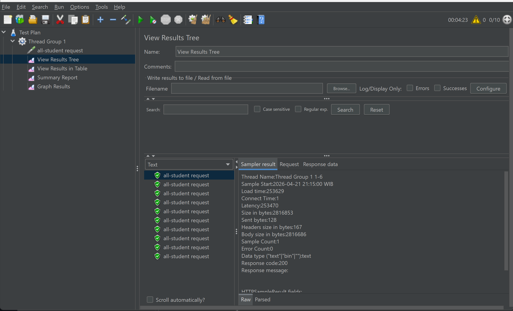

/all-students-name
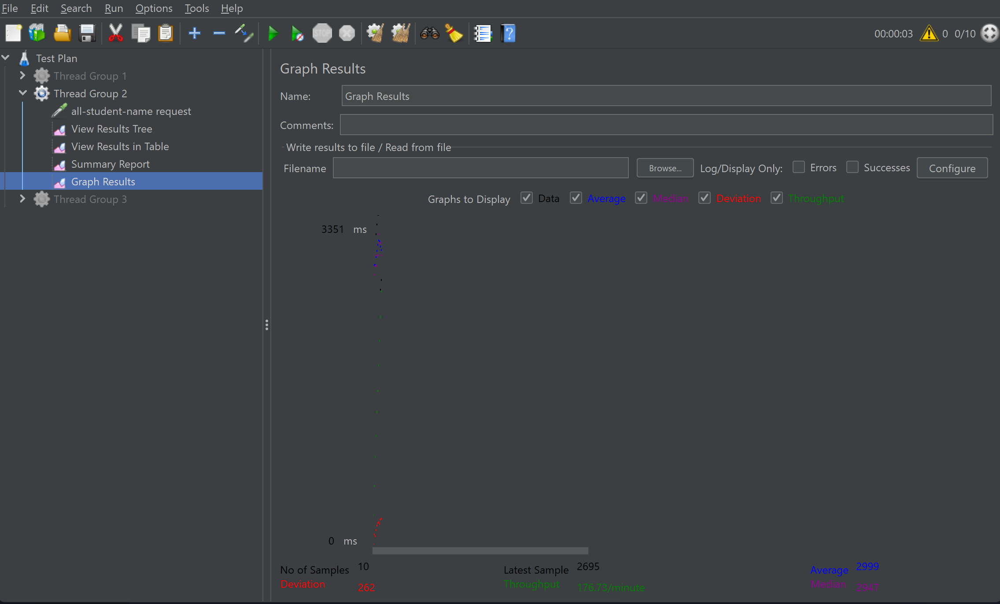
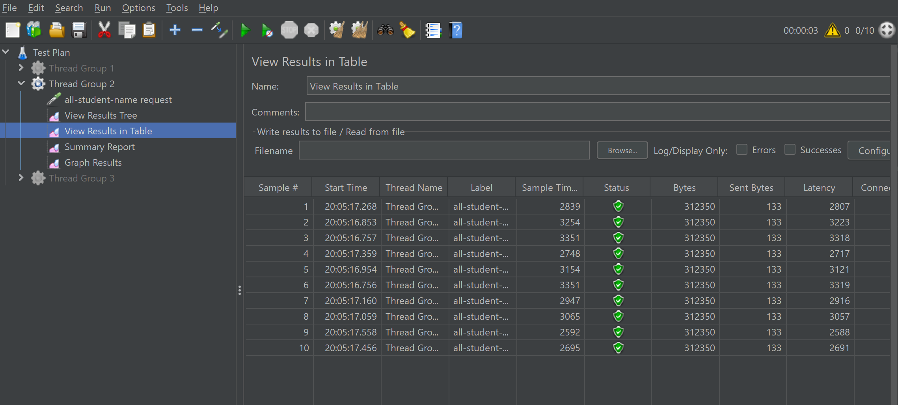
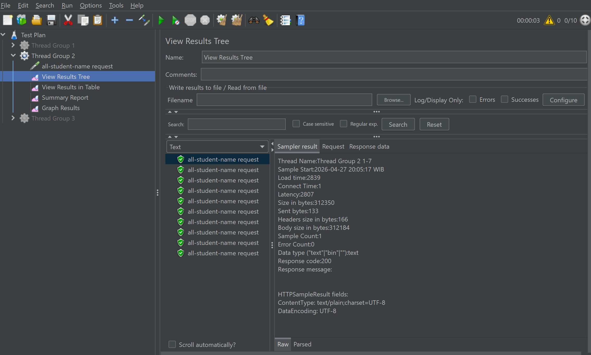
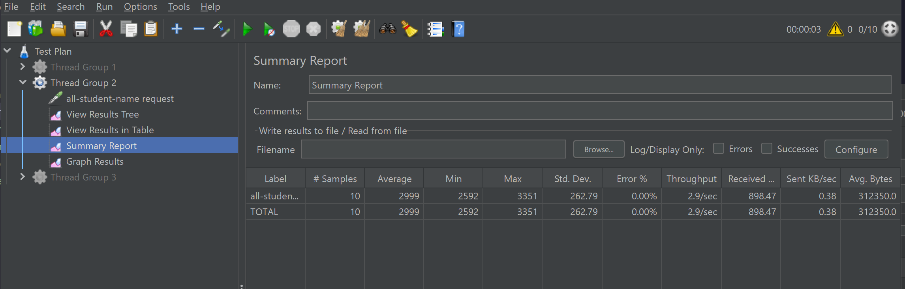

/highest-gpa
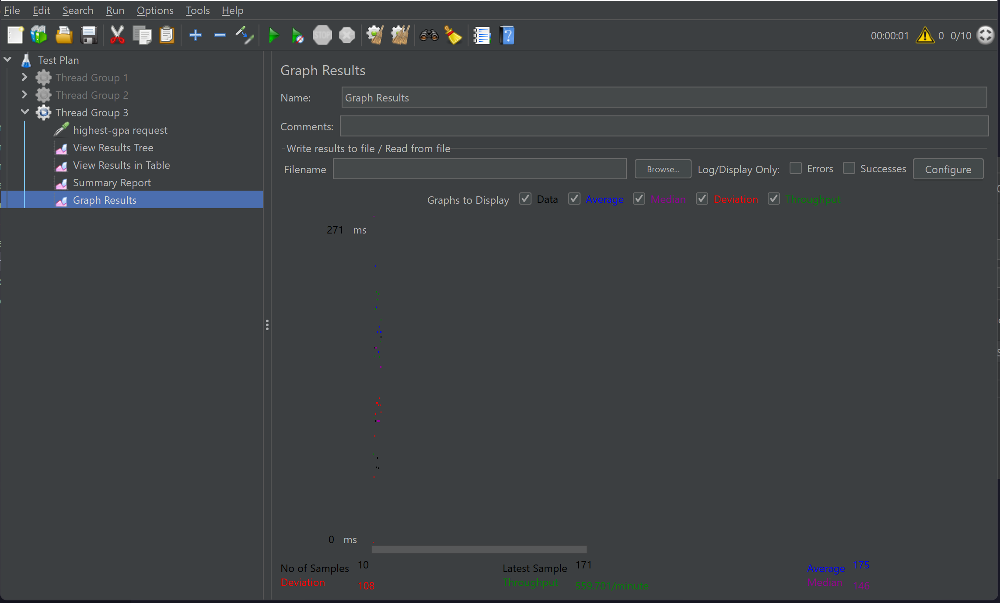
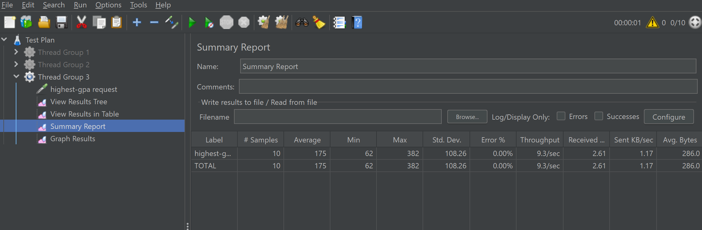
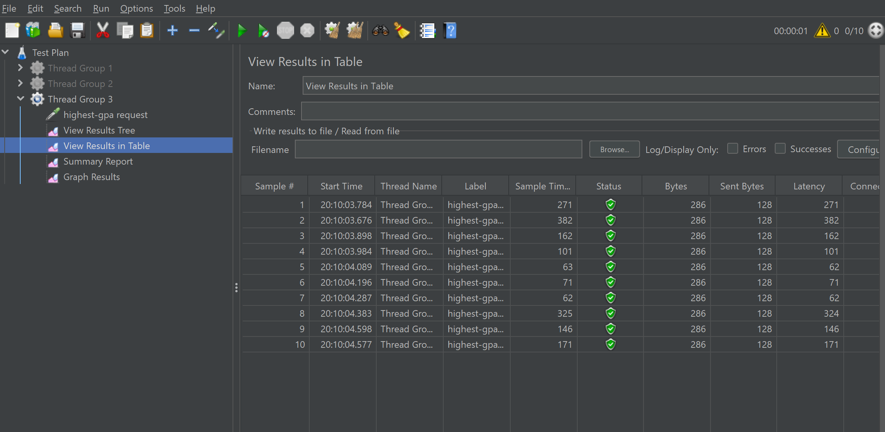
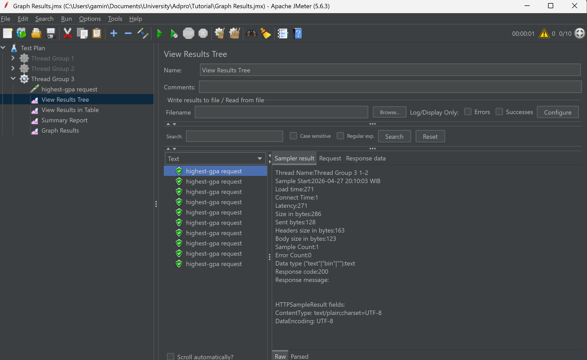

Using CLI:

/all-students
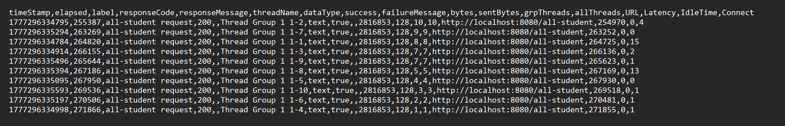
/all-students-name
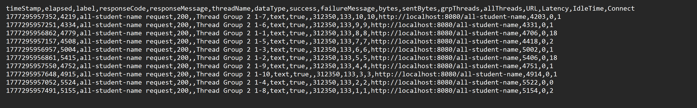

/highest-gpa:
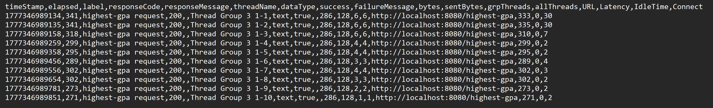

# Flame graphs
/all-student
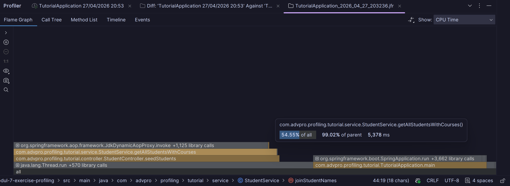

/all-student-name
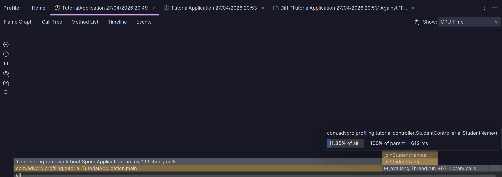

/highest-gpa
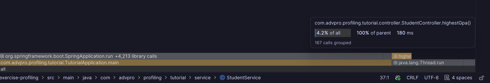

# After optimization

/all-student (`getAllStudentsWithCourses()`)
Profiler Result Comparison:
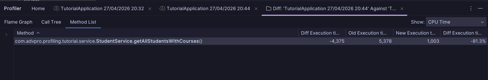

Jmeter Result:
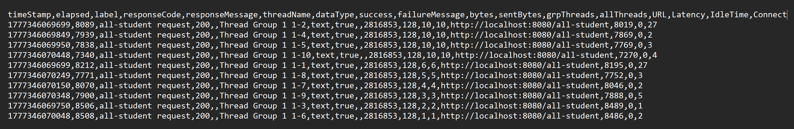

/all-student-name (`joinStudentNames()`)
Profiler Result Comparion:
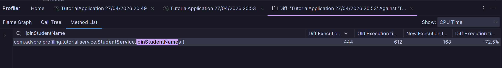

Jmeter Result:
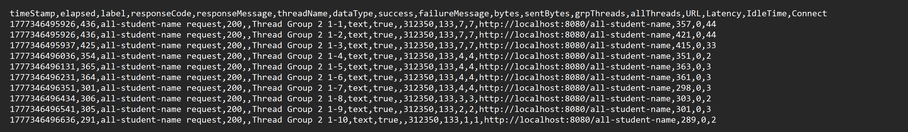

/highest-gpa
Profiler Result Comparion:
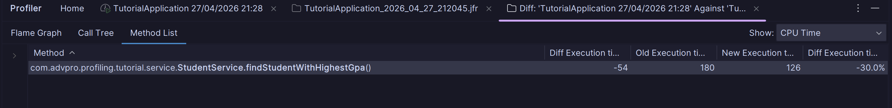

Jmeter Result:
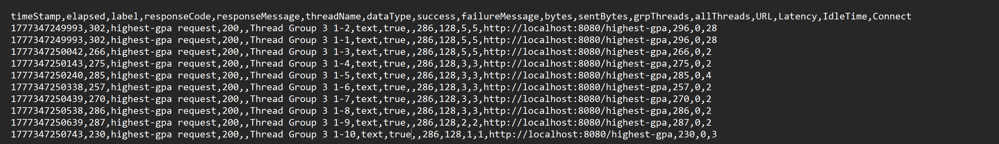

